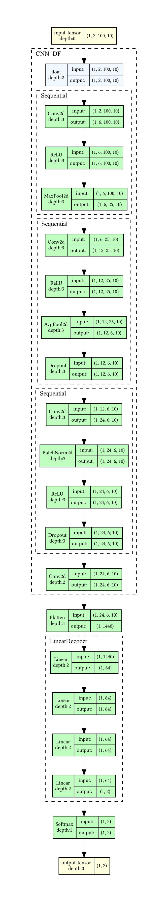

# Self-Supervised Streaming Time Series Classification

## Abstract

Streaming time series (STS) can be viewed as sequential concatenations of batch time series (TS), referred to as events, which are received incrementally. In practical scenarios, there exists a continuous flow of data, with only a limited number of labeled events available to address the STS classification problem. Recently, the dissimilarity frame (DF) feature representation has been proposed to handle STS classification. DFs transform STS into a sequence of images that can be effectively classified using standard CNN image classifiers.
In this study, we propose an enhancement of DFs for STS classification in the presence of scarce labeled data. This enhancement enables the capture of larger time patterns without necessitating an increased number of parameters. Additionally, leveraging the same principles underlying DFs, we adapt the popular image-based encoding technique, Gramian angular fields (GAF), for the same classification task. Furthermore, we introduce a self-supervised pretraining strategy for STS classifiers based on DFs and GAFs, enabling the utilization of unlabeled data from the STS data stream. Through experimental evaluation, we demonstrate that STS classifiers based on DFs and GAFs either match or surpass the performance of state-of-the-art STS classifiers.

<!---
<p align="center">
 </br>
 </br>
 </br>
<em>DF (left) vs GAF (right) encoding of several datasets. In order: CBF, GunPoint, Trace.</em>
</p>
-->

## Replication

In this section we detail the steps to replicate the experiments of the paper.

### Environment Setup

In order to setup the environment, we recommend using a virtual environment. The following commands will create a python virtual environment and install the dependencies.

```bash
git clone https://[repository_url]/s3ts.git     # clone the repo
cd s3ts                                         # move in the folder
python3 -m venv env                             # create virtualenv
source env/bin/activate                         # activate it
pip install -r requirements.txt                 # install dependencies
python -m pip install -e .                      # install s3ts package
```

### Running the Experiments Locally

There are several ways to run the experiments. The easiest way to replicate all the paper's results locally is to run the script **run_local.py** with the following command:

```bash
python run_local.py
```
By default, this script will run all the experiments in series (which takes a long time). It comes with several options to run only a subset of the experiments, or to run them with different parameters. There is also a CLI script, **s3ts/cli.py** to run individual experiments from the command line. For examples, to train the DF, CNN-based classifier on the GunPoint dataset, run the following command:

```bash
python s3ts.cli --dataset GunPoint --mode df --arch cnn
```

Several more seetings are available in the script's help display, accessible with the following command:

```bash
python s3ts.cli --help
```

### Running the Experiments on a Cluster

The experiments can also be run in parallel on an HPC cluster using the SLURM scheduler using the 'run_sbatch.py' script. It has the same settings as the **run_local.py** script, but it will submit each experiment as a separate job to the cluster. It requires the user to specify the path to the python virtual environment to use on the cluster.

Assuming the environment is loaded, the following command will submit all the experiments to the cluster:

```bash
python run_sbatch.py
```

### Reproducing the Analysis and Figures

The analysis and figures of the paper can be reproduced either running the **s3ts/analisis.py** script or the **analysis.ipynb** notebook. The notebook is more interactive and allows the user to explore the results in more detail.

The script **figures/networks/generator.py** can be used to generate network diagrams such as those in the same folder. It requires the **graphviz** package to be installed.

<p align="center">
 </br>
<em> Diagram of the CNN-based networks used for STS classification. </em>
</p>
